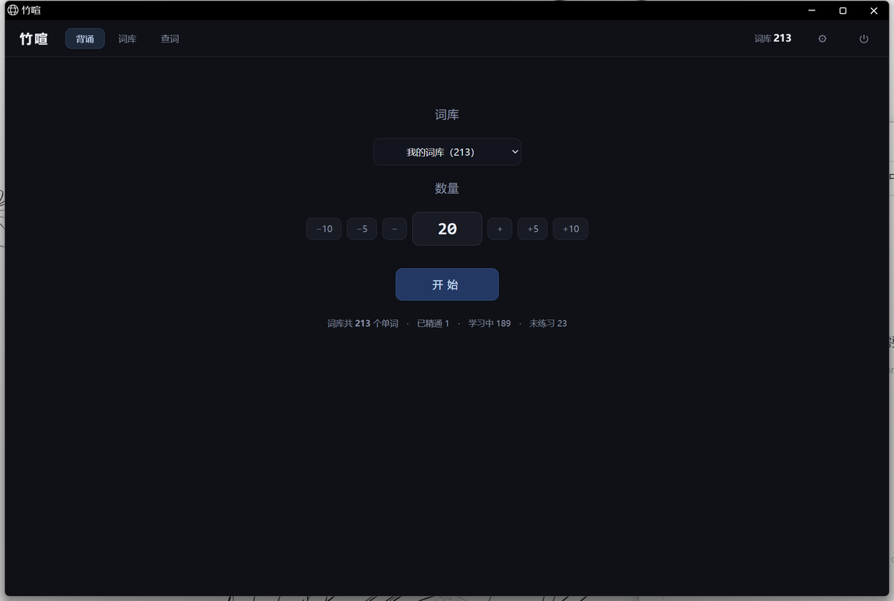
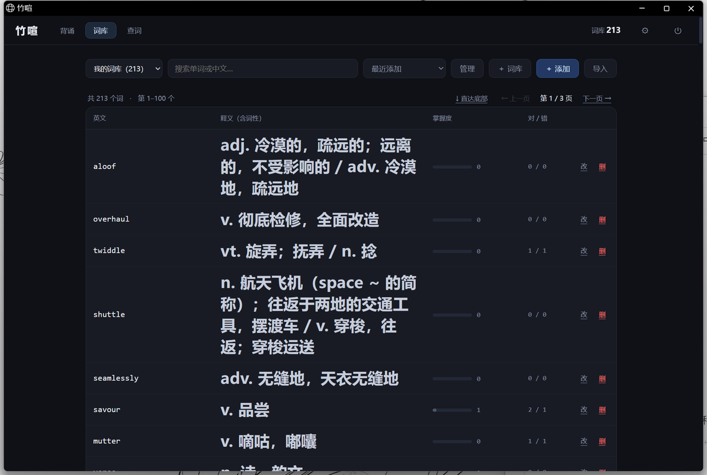
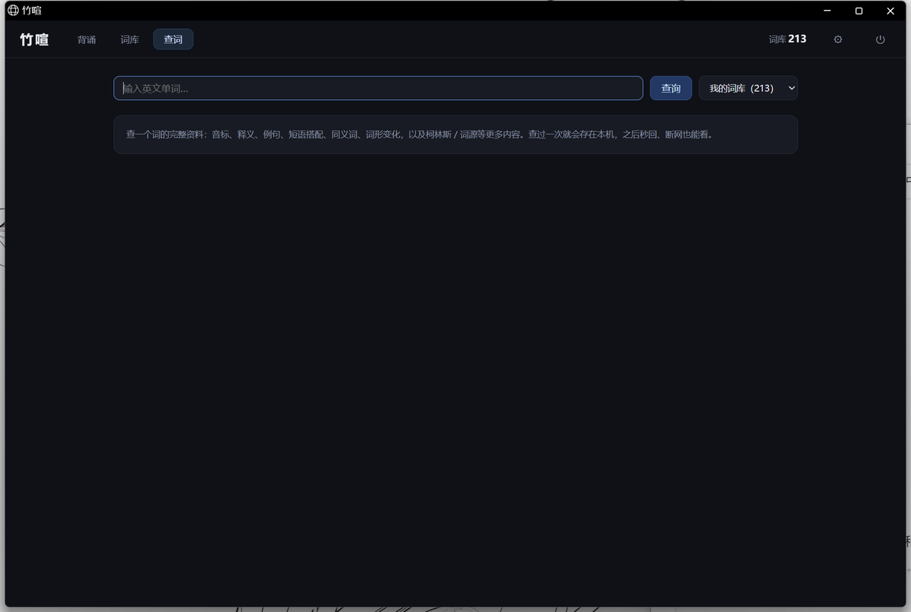

# 竹喧

> 看中文填英文的加权抽词背单词工具 · Windows 单文件 · 数据全部保存在本机

「竹喧」取自「竹喧归浣女」——竹林里有人说话，正是背单词时念念有词的画面。

**下载**：[`zhuxuan-v1.1.0.exe`](zhuxuan-v1.1.0.exe)（22.4 MB，双击即用，无需安装 Python）



## 下载使用

下载仓库里的 **[`zhuxuan-v1.1.0.exe`](zhuxuan-v1.1.0.exe)**（22.4 MB），
放到**桌面**（或任意有写入权限的文件夹），双击即可。

> **国内网络**：`github.com` 的网页下载可能非常慢或中断。可以用加速镜像：
>
> ```
> https://ghfast.top/https://github.com/kk4573/zhuxuan/raw/main/zhuxuan-v1.1.0.exe
> ```
>
> 把上面整行复制到浏览器地址栏回车即可（下载下来若文件名显示为乱码或没有后缀，
> 手动改回 `zhuxuan-v1.1.0.exe` 再双击）。

- **不需要安装 Python**，也不用装任何额外软件（用系统自带的 Edge 渲染界面）。
- 第一次双击若出现「Windows 已保护你的电脑」，点 **更多信息 → 仍要运行** 即可。
  这是因为个人项目没有购买代码签名证书，并非程序有问题。
- **第一次打开词库是空的**：点首页的「导入词表 →」，选一份内置词表（四级 / 六级 / 考研 / 托福 / GRE）导入就能开始。

## 它长什么样

| 背诵 | 词库 | 查词 |
|---|---|---|
|  |  |  |

## 主要功能

- **看中文填英文**：给中文释义，拼出对应单词；忽略大小写与首尾空格。
- **加权抽词**：越不熟的词出现得越勤。答对涨熟练度（连对涨幅更高），答错掉一档，
  当天已经考过的词会降权，避免一天内反复刷同一个词。
- **答错不限次重考**：错词回到本轮队尾，直到当场答对。每次答错都显示正确答案。
- **拼写逐字母比对**：错了会标出哪几个字母不对（但不会直接告诉你答案）。
- **英美拼写都算对**：`colour` / `color` 一类通过别名表识别。
- **自动补全释义与音标**：输入英文即可从在线词典取释义、音标、例句，本地缓存，
  查过的词不重复联网。
- **多词库**：一个词可以同时属于多个词库，熟练度跨词库共享。内置词表按需导入。
- **例句点词**：例句里任意单词点一下弹出小框看释义，可进一步跳转查词页或加入词库。
  自动识别单复数与时态（`children → child`、`nosed → nose`）。
- **真人发音**：联网发音，可关闭。
- **数据全在本机**：词库、学习记录都是本地 SQLite 文件，不联网、不上传、没有账号。

## 数据放在哪

exe 同级的 `data/` 目录：

```
竹喧.exe
data/
  words.db      ← 词库与学习记录（唯一的数据库）
  backups/      ← 每次启动自动备份，保留最近 10 份
  edge-profile/ ← 界面用的浏览器配置
```

**换电脑或备份，直接拷整个文件夹即可。**
如果 exe 放在写不进去的地方（比如 `C:\Program Files`），数据会自动改存到
`%LOCALAPPDATA%\竹喧`。

## 自己改、自己打包

需要 Python 3.11+。

```bash
pip install fastapi uvicorn openpyxl python-multipart pyinstaller pillow

# 开发时直接跑
python app.py

# 打包成单文件 exe（产物在 dist/）
pyinstaller --noconfirm --clean --onefile --windowed --name 竹喧   --icon app.ico --add-data "web;web" --collect-all uvicorn app.py
```

代码结构：

```
app.py            FastAPI 服务 + 全部接口 + 启动窗口
core/
  db.py           SQLite 全部 SQL
  srs.py          熟练度模型与加权抽词
  judge.py        答案判定（含英美拼写别名表）
  dictionary.py   在线词典、释义整理、词形还原
  vocab.py        内置词表下载与解析
  ai.py           DeepSeek 兜底（可选，默认不用）
  ime.py          答题时锁英文输入法（Win32）
  config.py       设置项
  paths.py        路径解析（源码 / exe 两种形态）
web/              前端（原生 HTML/CSS/JS，无框架）
tests/            自测脚本
```

## 可选的 AI 兜底

**默认不启用，不影响使用。** 只有遇到在线词典完全查不到的词（新词、缩写、专有名词）
才需要它生成释义。如果你有自己的 DeepSeek API Key，可以在设置里填入，
Key 只保存在本机 `config.json`，程序不会把它发往任何地方。

## 许可

[MIT](LICENSE)

## 致谢

- 内置词表来自 [mahavivo/english-wordlists](https://github.com/mahavivo/english-wordlists)
- 释义与发音来自有道词典的公开接口
